# Azure Linux VMs
This project can be used to create multiple Linux VMs with SSH key and zure feature like boot diagnostics using Terraform script. One can also leverage Jenkins Pipeline as code feature to automate VM's deployment in Azure on each code commit in the git repository.


## Contents

* [Project Prerequisites](#Project_Prerequisites)
	- Install & Configure Terraform
	- Install & Configure Jenkins
	- Install & Configure Git
	- Configure Visual Studio Code
	
* [Introduction to Hashicorp Configuration Language (Terraform)](#Introduction_to_Terraform)
	- Terraform Commands
	- Terraform Code for Multiple Linux VMs on Azure

* [Jenkins Integration with Git](#Jenkins_Git_Integration)
	- Jenkins Project Setup
	- Github Repository & Webhook Configuration


* [Features](docs/readmes/README.md#features)
* [What To Do Next?](#what-to-do-next)


## Project Prerequisites
You will need one Linux VM for installing the tools like Git, Terraform, Ansible. Below are the installation steps for required tools.

### 1. Install & Configure Terraform

- Install Wget Package 

  GNU Wget is a free and open source software package for retrieving files using HTTP, HTTPS, and FTP, the most widely-used Internet protocols. The GNU/wget might not be installed on your system and here is how to install it using yum command.
 
  ```shell
   sudo yum install wget unzip
   ```
- Download terraform package using wget.

  Here i am downloading Terraform version 11.13. But if you want to download latest version of terraform you can download it from [terraform website]
  
   ```shell
  wget  https://releases.hashicorp.com/terraform/0.11.13/terraform_0.11.13_linux_amd64.zip
  ```
- Unzip the downloaded package by using unzip command, it will extract one binary file called ‘terraform’  
   ```shell
  unzip terraform_0.11.13_linux_amd64.zip 
   ```
- Copy unzipped terraform file to /usr/local/bin
   ```shell
  sudo cp terraform /usr/local/bin
     ```
- Give executable permission    
   ```shell
  sudo chmod +x /usr/local/bin
     ```
- Now check terraform
	Because we have copied the binary file to /usr/local/bin, the terraform command is available. You can check its absolute path by using   command 
    ```shell
  which terraform
     ```    
- The below command will show the version of terraform.
   ```shell
  terraform --version   
    ```
### 2. Install & Configure Jenkins
- Jenkins is a Java application, so the first step is to install Java. Run the following command to install the OpenJDK 8 package:
   ```shell
  sudo yum install java-1.8.0-openjdk-devel   
    ```
- The next step is to enable the Jenkins repository. To do that, import the GPG key using the following curl command
   ```shell
  curl --silent --location http://pkg.jenkins-ci.org/redhat-stable/jenkins.repo | sudo tee /etc/yum.repos.d/jenkins.repo   
    ```
- And add the repository to your system with below command
   ```shell
  sudo rpm --import https://jenkins-ci.org/redhat/jenkins-ci.org.key   
    ```
- Once the repository is enabled, install the latest stable version of Jenkins by typing:
   ```shell
  sudo yum install jenkins   
    ```
- After the installation process is completed, start the Jenkins service with:
  ```shell
  sudo systemctl start jenkins   
    ```
- To check whether it started successfully run:
  ```shell
  systemctl status jenkins   
    ```
- Finally enable the Jenkins service to start on system boot.
  ```shell
  sudo systemctl enable jenkins   
    ```
- If you are installing Jenkins on a remote CentOS server that is protected by a firewall you need to open port 8080. Use the following commands to open the necessary port. Also make sure that you have opened the http port on Azure NSG inside VM's networking option
  ```shell
  sudo firewall-cmd --permanent --zone=public --add-port=8080/tcp
  sudo firewall-cmd --reload  
    ```
- If you want to access jenkins console from your local desktop, then you need to bind local 8080 port with the VM on which jenkins is installed. Also make sure that your VM and Desktop public keys are identical.
  ```shell
  ssh -L 127.0.0.1:8080:localhost:8080 Nancy@ansi.southindia.cloudapp.azure.com  
    ```
#### 2.1 Setting up Jenkins
 - To set up your new Jenkins installation, open your browser and type your domain or IP address followed by port 8080. If your VM is on    any cloud platform then use public IP of that vm to access Jenkins console. If you have bind your local desktop's port 8080 to the VM    then simply type localhost and Jenkins console will show up as below
    ```shell
  	http://your_ip_or_domain:8080
  	http://localhost:8080
  	http://<DNS Name of Azure Cloud VM>:8080
     ```
   
   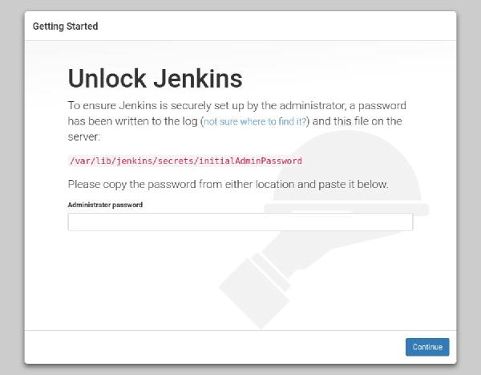
 
 - Use the following command to print the password on your terminal:
     ```shell
  	sudo cat /var/lib/jenkins/secrets/initialAdminPassword
     ```
 - Copy the password from your terminal, paste it into the Administrator password field and click Continue
   
   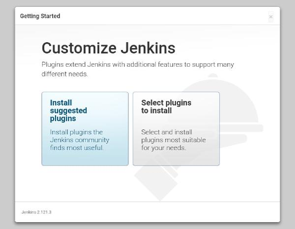
 - On the next screen, you will be asked whether you want to install the suggested plugins or to select specific plugins. Click on  	the Install suggested plugins box, and the installation process will start immediately.
   
   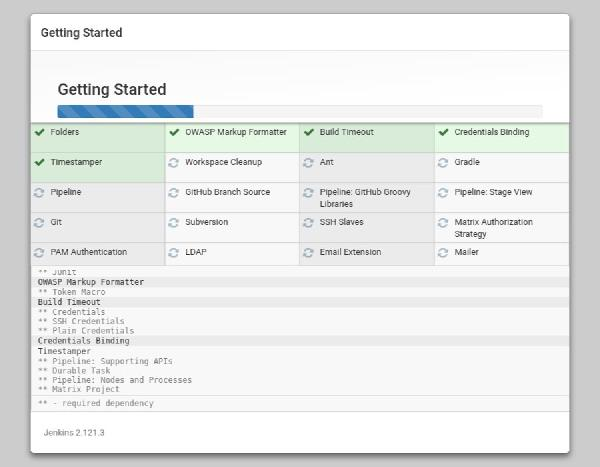
   
 - Once the installation is complete, you will be prompted to set up the first administrative user. Fill out all required information and click Save and Continue.
 
   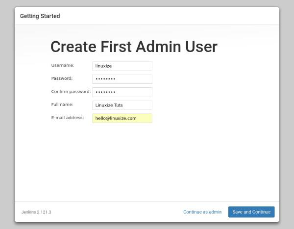 
 
 - On the next page, you will be asked to set the URL for the Jenkins instance. The URL field will be populated with an automatically generated URL.

   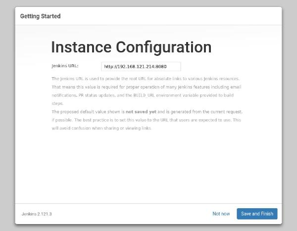
 - To complete the setup confirm the URL by clicking on the Save and Finish button.
 
   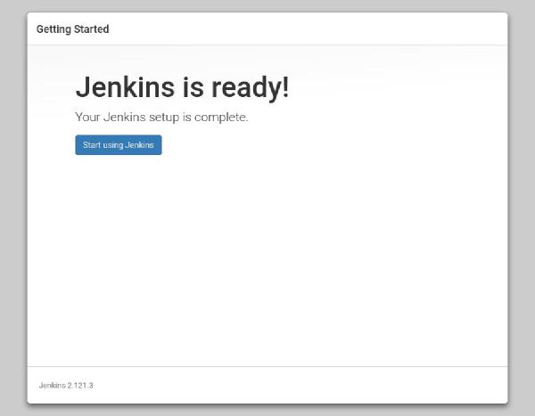
   
 - Finally, click on the Start using Jenkins button and you will be redirected to the Jenkins dashboard logged in as the admin user you have created in one of the previous steps. 
   
   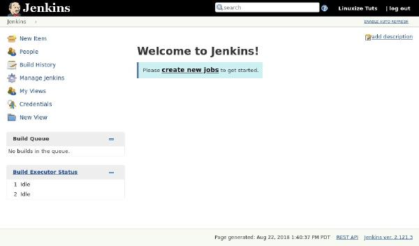
 
### 3. Install and configure Git
   Git is a free and open source, fast and distributed version control system (VCS), which by design is based on speed, efficient   performance and data integrity to support small-scale to extensive software development projects.
   Git is a software repository that allows you to keep a track of your software changes, revert to previous version and create another versions of files and directories.
   Git is written in C, with a mix of Perl and a variety of shell scripts, it’s primarily intended to run on the Linux kernel

 - Install Git using below command
     ```shell
  	sudo yum install git
	git --version
     ``` 
 - Set Up Git Account
   You can start by creating a Git user with the useradd command as below, where the -m flag used to create the user’s home directory    under /home and -s specifies the user’s default shell.
      ```shell
  	useradd -m -s /bin/bash username 
        passwd username
     ``` 
 - Now, add the new user to the wheel group to enable the account to use the sudo command
      ```shell
  	usermod username -aG wheel
     ``` 
 - Then configure Git with the new user as follows
      ```shell
         su username 
	 sudo git config --global user.name "Your Name"
	 sudo git config --global user.email "you@example.com"
     ``` 
- Now verify Git configuration using following command
     ```shell
  	sudo git config --list
     ``` 

### 4. Configure Visual Studio code on Local Windows Desktop to connect to Linux VM.

- Download and install Visual Studio Code on windows desktop from this [Microsoft Website]
- Once you installed Visual Studio Code, you need to add an extention named "SSH FS". This extention allows you to access files from your Linux VM. Please refer below picture. 
	
	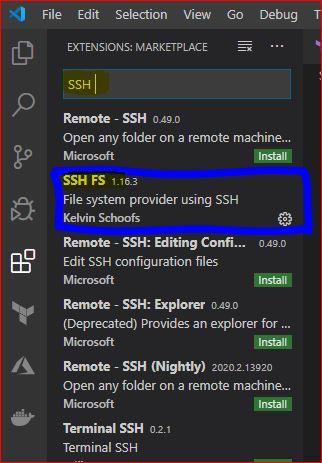
	
- After installing SSH FS extention, you need to configure the extention by right click abd select "Extention Setting" as shown in below picture.

	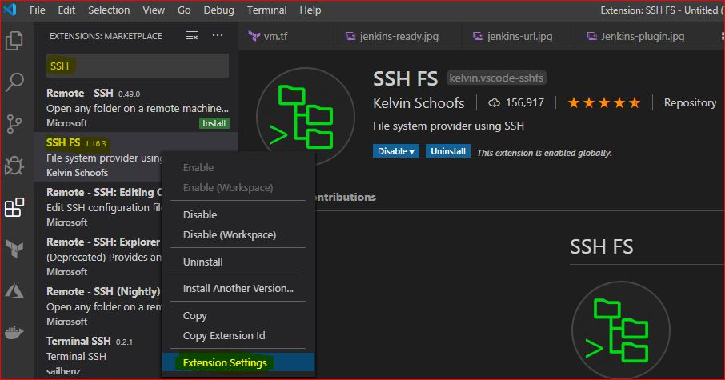

- Please provide appropriate value and configure the extention & save the extention settings.

	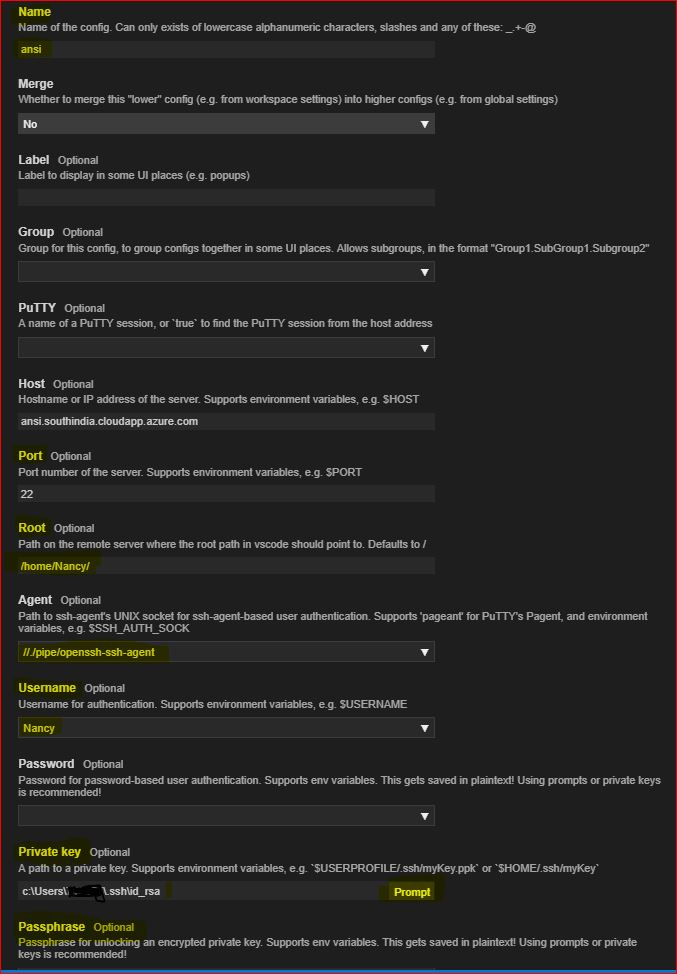
	
- To connect & access linux vm, simply right click on the ssh fs connection name and click on connect as workspace.

	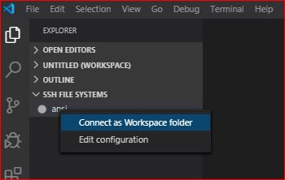
	
## Code Demo
In this section we are going to authenticate Azure cloud using application id and secret which we have created in earlier section and also we will be creating two Azure Linux VMs using terraform Code.

## Introduction to Hashicorp Configuration Language (Terraform)
Terraform is a tool for building, changing, and versioning infrastructure safely and efficiently. Terraform can manage existing and popular service providers as well as custom in-house solutions.
Configuration files describe to Terraform the components needed to run a single application or your entire datacenter

### Terraform Common Commands
Terraform is controlled via a very easy to use command-line interface (CLI). Terraform is only a single command-line application: terraform. This application then takes a subcommand such as "apply" or "plan".
 
| Common commands | Description |
| --- | --- |
| apply | Builds or changes infrastructure |
| console | Interactive console for Terraform interpolations |
| destroy | Destroy Terraform-managed infrastructure |
| env | Workspace management |
| fmt | Rewrites config files to canonical format |
| get | Download and install modules for the configuration |
| graph | Create a visual graph of Terraform resources | 
| import | Import existing infrastructure into Terraform |
| init | Initialize a Terraform working directory |
| output | Read an output from a state file |
| plan | Generate and show an execution plan | 
| providers | Prints a tree of the providers used in the configuration |
| refresh | Update local state file against real resources |
| show | Inspect Terraform state or plan |
| taint | Manually mark a resource for recreation |
| untaint | Manually unmark a resource as tainted |
| validate | Validates the Terraform files |
| version | Prints the Terraform version |  
| workspace | Workspace management |

| All other commands | Description |
| :--- | :---|
| 0.12upgrade | Rewrites pre-0.12 module source code for v0.12 |       
| debug | Debug output management (experimental) |
| force-unlock | Manually unlock the terraform state |
| push | Obsolete command for Terraform Enterprise legacy (v1) |
| state | Advanced state management |   

### Terraform Code for Multiple Linux VMs on Azure
   1) Create Service Principle in Azure for terraform.
   
      Please follow the steps from Microsoft article for [Azure AD app registration]
      
   2) Inside your Centos VM, create a folder Named terraform and create a file named terraform.tfvars. Copy below text and replace it         with actual values that you have noted from app registration. 
  
      terraform\terraform.tfvars
      
	subscription_id=<Copy Subscription ID from Azure Portal>
	client_id=<Copy Client ID from Azure AD app registration>
	client_secret=<Copy Client secrete from Azure AD app registration>
	tenant_id=<Copy Tenant ID from Azure AD app registration>
  
       Note:- If you dont want to define above confidential credentials in the file then you can define it as Envoirnment variable like         below.
   
	export TF_VAR_subscription_id= <Copy Subscription ID from Azure Portal>
	export TF_VAR_client_id= <Copy Client ID from Azure AD app registration>
	export TF_VAR_client_secret=<Copy Client secrete from Azure AD app registration>
	export TF_VAR_tenant_id=<Copy Tenant ID from Azure AD app registration>

3) Below is the code to create new VMs in an existing resource group and Virtual Network
	 ```shell
		provider "azurerm" {
		version = "~> 1.25"
		subscription_id="${var.subscription_id}"
		client_id="${var.client_id}"
		client_secret="${var.client_secret}"
		tenant_id="${var.tenant_id}"
  		}
	    // Importing existing resource group
		data "azurerm_resource_group" "res_group"{
    		name  = "${var.resource}"
   		}
		
	     // Importing existing Virtual Network and subnet
		data azurerm_virtual_network "Vnet" {
		    name = "${var.vnet_name}"
		    //address_space = ["10.5.0.0/16"]
		    //location = "${var.azurerm_location}"
		    resource_group_name = "${data.azurerm_resource_group.res_group.name}"
		}
		output "virtual_network_id" {
		  value = "${data.azurerm_virtual_network.Vnet.id}"
		}

		data azurerm_subnet "subnet" {
		    name = "${var.subnet_name}"
		    //address_prefix = "10.5.40.0/22"
		    virtual_network_name = "${data.azurerm_virtual_network.Vnet.name}"
		    resource_group_name = "${data.azurerm_resource_group.res_group.name}"
		}
		output "subnet_id" {
		  value = "${data.azurerm_subnet.subnet.id}"
		}
		
	   //Creating network interfaces for multiple vms.Count is the veriable provided by Terraform to configure multiple resources
	   
		resource "azurerm_network_interface" "nic" {
		  count= "${var.nodecount}"
		  name= "${var.prefix}-${var.vm_name}-${count.index}-nic"
		  location = "${var.azurerm_location}"
		  resource_group_name = "${data.azurerm_resource_group.res_group.name}"

		  ip_configuration {
		      name = "${var.prefix}-nicConfig"
		      subnet_id= "${data.azurerm_subnet.subnet.id}"
		      private_ip_address_allocation="Dynamic"
		      public_ip_address_id          = "${element(azurerm_public_ip.pip.*.id,count.index)}"

			}
		}

		resource "azurerm_public_ip" "pip" {
		  count= "${var.nodecount}"
		  name= "${var.prefix}-${var.vm_name}-${count.index}-nic"
		  location = "${var.azurerm_location}"
		  resource_group_name = "${data.azurerm_resource_group.res_group.name}"
		  allocation_method = "Dynamic"

		  tags {
		    environment = "${var.environment}"
		  }
		}
		
		resource "azurerm_managed_disk" "dd" {
       		count= "${var.nodecount}"
	      name = "${var.prefix}-${var.vm_name}-${count.index}-DataDisk-${count.index}"
	      location  = "${var.azurerm_location}"
	      resource_group_name = "${data.azurerm_resource_group.res_group.name}"
	      storage_account_type = "${var.managed_disk_storage_account_type}"
	      create_option        = "${var.managed_disk_create_option}"
	      disk_size_gb         = "${var.managed_disk_size_gb}"

	}
		# Creating Multiple VMs
		resource "azurerm_virtual_machine" "vm" {
		      count= "${var.nodecount}"
		      name = "${var.prefix}-${var.vm_name}-${count.index}"
		      location="${var.azurerm_location}"
		      resource_group_name = "${data.azurerm_resource_group.res_group.name}"
		      network_interface_ids = ["${element(azurerm_network_interface.nic.*.id,count.index)}"]
		      vm_size = "${var.vm_size}"
		      delete_os_disk_on_termination = "${var.delete_os_disk_on_termination}"
		      //delete_data_disk_on_termination = "${var.delete_data_disk_on_termination}"

		      storage_image_reference {
		      publisher = "${var.vm_image_publisher}"
		      offer = "${var.vm_image_offer}"
		      sku = "${var.vm_image_sku}"
		      version = "${var.vm_image_version}"
		      }

		      storage_os_disk {
		      name = "${var.prefix}-osdisk${count.index}"
		      caching = "ReadWrite"
		      create_option = "FromImage"
		      managed_disk_type = "${var.managed_disk_type}"
		      disk_size_gb      = "${var.os_disk_size_gb}"
		      }

		# Adding additional disk  to multiple VMs

		    storage_data_disk {
		    name            = "${element(azurerm_managed_disk.dd.*.name, count.index)}"
		    managed_disk_id = "${element(azurerm_managed_disk.dd.*.id, count.index)}"
		    create_option   = "Attach"
		    lun             = 0
		    disk_size_gb    = "${element(azurerm_managed_disk.dd.*.disk_size_gb, count.index)}"
		    }

		      #define credentials # How can we create VM without specifying password in the code.
		      os_profile {
		      computer_name ="${var.prefix}-${var.vm_name}-${count.index}"
		      admin_username = "${var.VM_ADMIN}"
		     // admin_password = "${var.VM_PASSWORD}"
		      }

		       os_profile_linux_config {
		    disable_password_authentication = true

		    ssh_keys {
		      path     = "/home/${var.VM_ADMIN}/.ssh/authorized_keys"
		      key_data = "${file("/etc/ssh/ssh_host_rsa_key.pub")}"
		    }
		  }
		   boot_diagnostics {
		    enabled     = "${var.boot_diagnostics_storage_uri != "" ? true : false}"
		    storage_uri = "${var.boot_diagnostics_storage_uri}"
		  }

		// Adding Provisioner for Ansible
		  provisioner "local-exec" {
		 command = "sleep 120; ANSIBLE_HOST_KEY_CHECKING=False \ansible-playbook -u Nancy --private-key '${file("/etc/ssh/ssh_host_rsa_key")}' -i '${azurerm_public_ip.pip.*.ip_address},' Pingtest.yml"
	    }
	```

[terraform website]: https://www.terraform.io/downloads.html
[Microsoft Website]: https://code.visualstudio.com/download
[Azure AD app registration]: https://docs.microsoft.com/en-us/azure/active-directory/develop/howto-create-service-principal-portal
